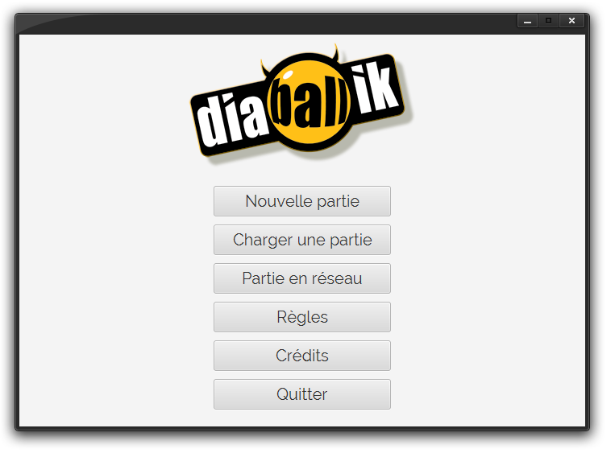
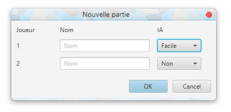
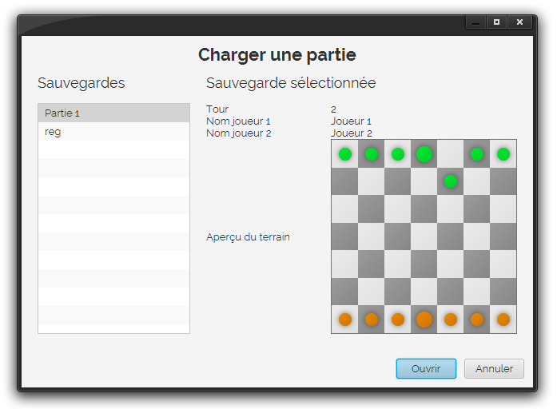
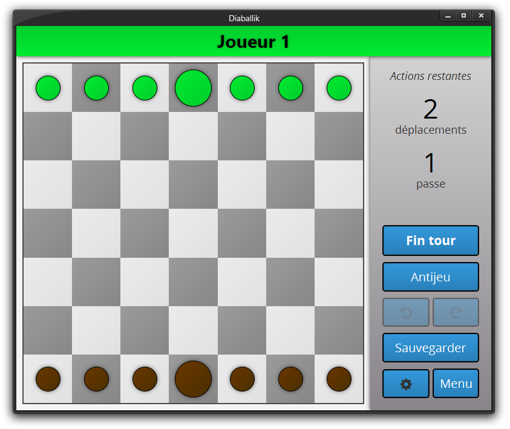
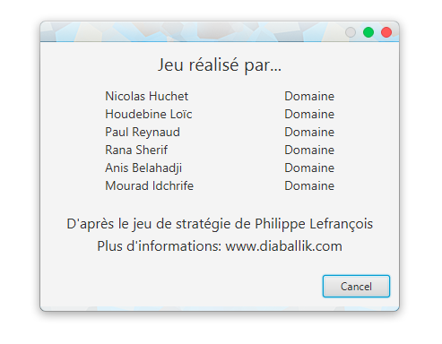

# ProjetDiaballik
## To do
Par ordre de priorité:
* Popup règles
* Système de sauvegarde: géré en interne plutôt que 
faire manipuler les fichiers à l'utilisateur (charger fait, voir pour
la sauvegarde)
* IA (aléatoire, minimax)
* Améliorer visuel et IHM de la partie jeu (couleurs, effets, anims, images pions)
* (Jeu en réseau) ?

## Images
IHM réalisées par Loïc Houdebine (voir lien dans la dernière section)
### Menu

### Nouvelle partie

### Charger partie

### Jeu

### Crédits

## Liens
[Site projet](http://inf362.forge.imag.fr/Projet/)

[Règles Diaballik](http://inf362.forge.imag.fr/Projet/Regles/diaballik/)

[IHM](https://app.moqups.com/zackattack/yyQzm1eIJU/view/page/ab2de651c)