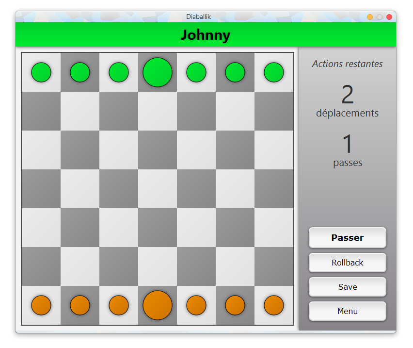

# ProjetDiaballik

## To do

Par ordre de priorité:
* Popup config nouvelle partie
* Popup règles
* Popup crédits
* Système de sauvegarde: géré en interne plutôt que 
faire manipuler les fichiers à l'utilisateur
* Améliorer visuel et IHM de la partie jeu (couleurs, effets, anims, images pions)
* (Jeu en réseau) ?

## Images
### Menu

### Jeu

## Liens

[Site projet](http://inf362.forge.imag.fr/Projet/)

[Règles Diaballik](http://inf362.forge.imag.fr/Projet/Regles/diaballik/)

[IHM](https://app.moqups.com/zackattack/yyQzm1eIJU/view/page/ab2de651c)