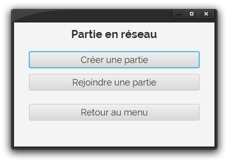
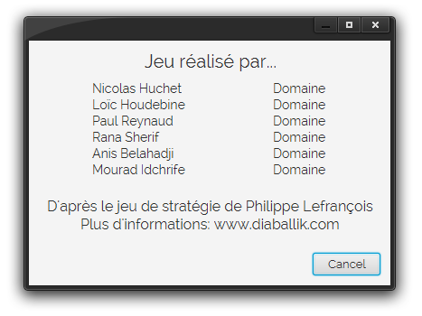

# ProjetDiaballik
## To do
voir TODO.md

## Liens
[Site projet](http://inf362.forge.imag.fr/Projet)

[Règles Diaballik](http://inf362.forge.imag.fr/Projet/Regles/diaballik)

[IHM](https://app.moqups.com/zackattack/yyQzm1eIJU/view/page/ab2de651c)

## Images (à jour)
IHM réalisées par Loïc (voir lien dans la dernière section)

### Menu

### Nouvelle partie

### Charger partie

### Partie en réseau (menu)

### Partie en réseau (menu créer)

### Partie en réseau (menu rejoindre)

### Partie en réseau (attente d'un joueur)

### Jeu avec notation des cases

### Jeu sans notation des cases

### Jeu contre IA

### Crédits

